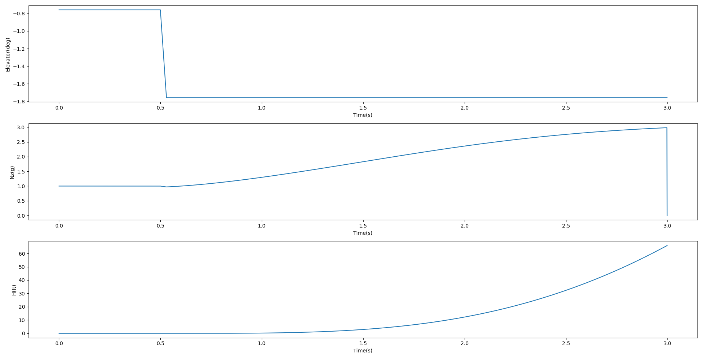
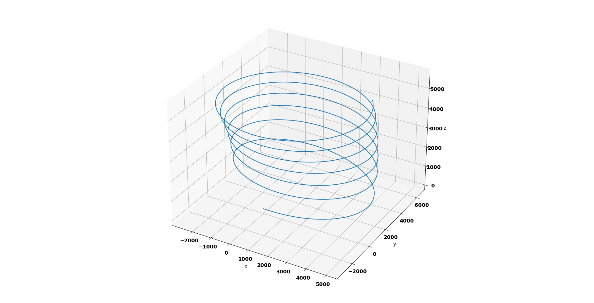

# AeroplaneDynamics
The model of the General Dynamics F16 is documented in 
[Stevens and Lewis](https://www.amazon.com/Aircraft-Control-Simulation-Brian-Stevens/dp/0471371459) along with Fortran code which simulates the non-linear model. The dynamic model is also available in Scilab thanks to [McFlight](https://github.com/fsandre/mcflight) on Github. 
The dynamic model is now available in Python. 

The following scripts are used to simulate the dynamics of an F16:
* atmosphere.py: Atmosphere equations from [International Standard Atmosphere](https://ntrs.nasa.gov/archive/nasa/casi.ntrs.nasa.gov/19770009539.pdf) (ISA)
* eqm.py: Equations of motion (Force, kinematic, moment and navigation equations)
* trim.py: Script to determine the trim conditions (conditions at steady flight).
* params.py: Aerodynamic coefficients of an F16
* engine_f16.py: F16 engine model

The python libraries used to simulate the model are:
* Scipy: This is used to minimise the trim_cost_function which determines the trim conditions and odeint, which is an ordinary differential equation solver, is used to solve the equations of motion.
* Numpy: Numerical calculations (e.g. cos, sin, arange)
* Pandas: To create objects containing the results
* Matplotlib: Library to create 2D and 3D visualisations

# Simulations
There are two scripts which simulate the equations of motion:
1. sim_f16.py
2. coordinate_f16.py

A description of each file is given below.

## Simulate elevator step
The script *sim_f16.py* simulates the dynamics of an F16 to a step change in the elevator. The results of the simulation are shown in the figure below. The order of the trends are:
1. Elevator unit step change
2. Acceleration in the z axis (nz)
3. Altitude (H)

## Simulate coordinated turn
The script *coordinate_f16.py* simulates a coordinated turn of an F16. The results of the simulation are shown in the figure below. The figure is a three dimensional plot of the F16 representing the north (x), east (y) and vertical (z) navigation of the plane.

# TODO:
* Linearise the model
* Add control laws
